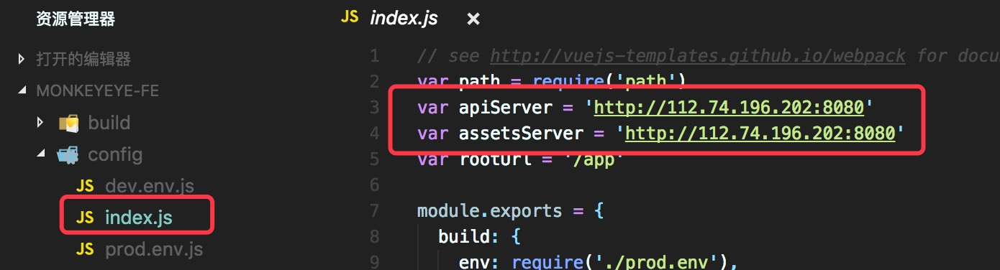
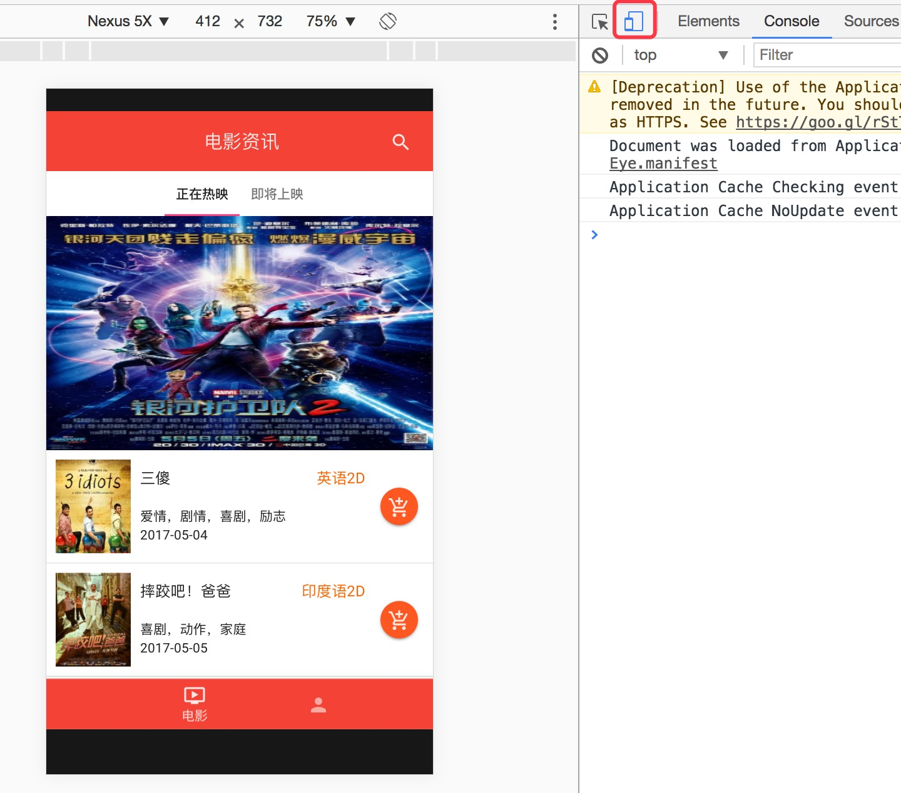

# 安装部署说明
##### 小组成员：黄建武、洪创煌、骆铭涛、陈平永

## 一、Server
安装Python环境和依赖， 推荐 Python2.7
```bash
sudo apt-get install libmysqlclient-dev python-dev redis-server   # Ubuntu 下
sudo yum install mysql-devel python-dev redis                     # CentOS 下
```

安装虚拟环境
```bash
pip install virtualenv
```

克隆仓库后，切换到项目文件夹，在项目文件夹下打开终端，新建虚拟环境，会生成一个`venv`的文件夹
```bash
virtualenv venv
```

激活虚拟环境，激活后终端的提示符会出现 `(venv) $`
```bash
source venv/bin/activate       # Linux 下
venv\scripts\activate          # Windows 下
```

安装第三方模块
```
pip install -r requirements
```

切换主程序目录`Flask-Server`，使用以下命令运行项目
```
gunicorn -c gunicornConf.py server:app
```

**注意** 运行项目前，需要在Flask-Server目录下新建`instance`目录，并在`instance`目录下新建`__init__.py`文件和`config.py`文件，在`config.py`中添加项目的私密配置
```python
SECRET_KEY = 密钥
SQLALCHEMY_DATABASE_URI = 数据库链接
APPKEY = 短信服务key
APPSECRET = 短信服务secret
ADMIN = (管理员用户名, 管理员密码)
MAILSERVER = 邮件服务器
MAILKEY = 邮件服务器key
REDIS = (redis服务器, redis密码)
```

运行项目之后访问 http://localhost:5000/admin 进入后台管理系统，访问 http://localhost:5000/swagger 进入 Swagger UI 界面，可查看和测试 API。

## 二、Front-End
前端项目的部署步骤如下，首先安装项目需要的 npm 依赖包。
```bash
npm install
```

然后启动构建，得到前端的产品文件。
```bash
npm run build
```

完成构建后在 config/index.js 文件中配置好服务器的地址。



配置好之后，就可以启动中间层的 NodeJS 服务器了。服务器默认监听 8080 端口，访问该端口即可进入应用。
```bash
npm run server
```

我们的应用是移动端的应用，如果使用PC的浏览器打开，还需要再开启移动端视角。下面是使用 Chrome 浏览器打开应用时的操作示例，打开 Chrome 的开发者工具，点击红框所圈出的手机图标即可进入移动端视角。


