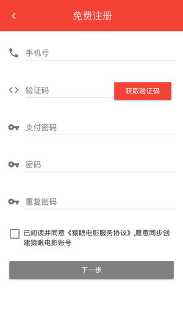
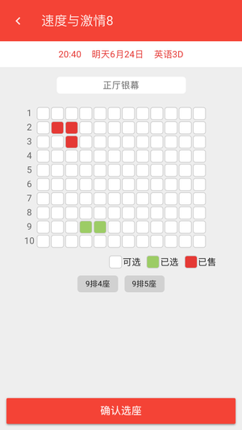

# 猿眼电影用户使用手册

## 一、软件概述

### 概述

**猿眼电影**是一家集电影资讯浏览、在线选座购票、用户评论互动等服务的一站式电影互联网平台。

### 功能

* 用户登录注册，编辑个人信息
* 电影资讯浏览，热播电影推荐
* 选座下单购票，立即在线支付
* 评论已看电影，写下观影后感

## 二、运行环境

该网站可以在移动端浏览器（桌面版浏览器需要设置为手机设备浏览模式）上进行使用，除此之外，还可以到[下载](http://112.74.196.202:8080/static/MonkeyEye.apk)安卓版apk安装并运行。

## 三、使用方法

### 网站浏览

1. 在移动端浏览器网址输入栏中输入以下网址：[http://112.74.196.202:8080/](http://112.74.196.202:8080/)，即可访问猿眼电影网站。
2. 可安装安卓版apk，打开应用程序即可访问猿眼电影网站。

### 用户注册

用户第一次访问的时候，通过以下步骤进行用户注册：点击底部导航栏`我的`->`点击此处进行登录`->`还没有账号？立即注册`，界面如图：

### 用户登录
注册成功的用户通过以下步骤进行用户登陆：点击底部导航栏`我的`->`点击此处进行登录`，界面如图：

### 电影资讯
访问网站的首页即可浏览最近上映的电影简讯(包括名称、海报、类型和上映日期)，点击右上角搜索按钮可以搜索某部电影，点击列表中的某部电影和轮播图中的海报都可以跳转至对应的电影详情，点击列表中某部电影的购物车按钮即可立即购票：

### 电影详情
以下为电影详情界面，其中右上角点击可以收藏，下面为电影详情以及用户评论，点击底部立即购票按钮即可跳转至购票页面：

### 选座购票

首先是选择场次，界面如下：

点击选座将跳转至选座页面，其中白色为可选座位，绿色为用户已选座位，红色为已售座位（用户不可选择），每个用户每次最多只能购买四张电影票，界面如下：

点击确认选座跳转至确认订单页面，界面如下：

点击立即下单跳转至支付页面，订单的支付有效时间是在下单之后的15分钟内，逾期订单将被撤销，在支付前可以选择可用的优惠券进行折扣，下单界面如下：

点击立即支付将弹出输入支付密码的密码框，支付密码错误将提示重新输入，界面如下：

支付密码成功将自动跳转至订单详情页面，界面如下：

### 个人中心
进入首页，点击底部导航栏`我的`将可以跳转至个人中心页面，点击第一栏可以跳转至用户信息页面，点击优惠券可以跳转至优惠券页面，在`我的订单`一栏点击`全部`、`待付款`、`未放映`、`已放映`可以分别跳转至对应类型的订单列表，下面点击`我的收藏`、`期待上映`、`观影历史`也可以分别跳转至对应的页面。个人中心的界面如下：

### 用户信息
用户信息页面展示用户的基本信息，假如想进行编辑某项信息，直接点击对应的一栏即可，其中点击底部退出登录按钮可以退出登录，用户信息界面如下：

### 订单列表
订单列表展示对应类型的订单，点击某个订单可以跳转至订单详情页面（在**选座购票**中的最后一张图），界面如下：

### 优惠券
用户完成订单支付有概率获得一张优惠券，优惠券界面如下：

### 电影收藏
用户可以收藏喜欢的电影，收藏界面如下：

