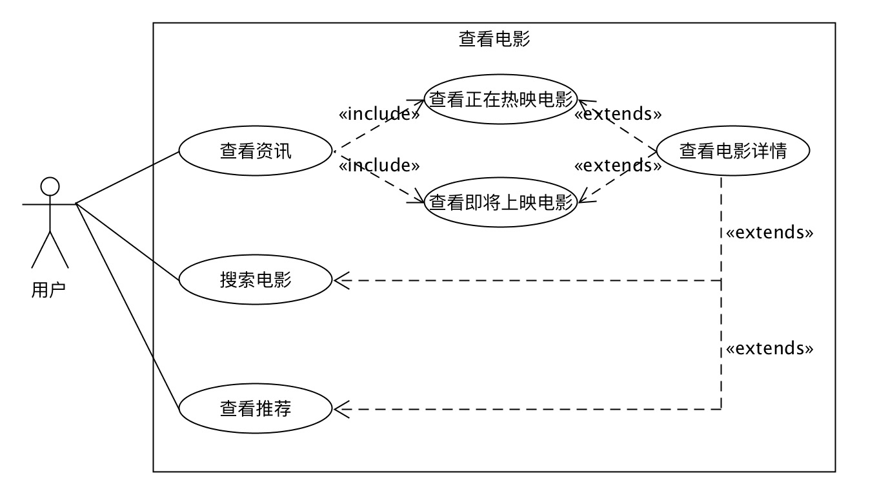
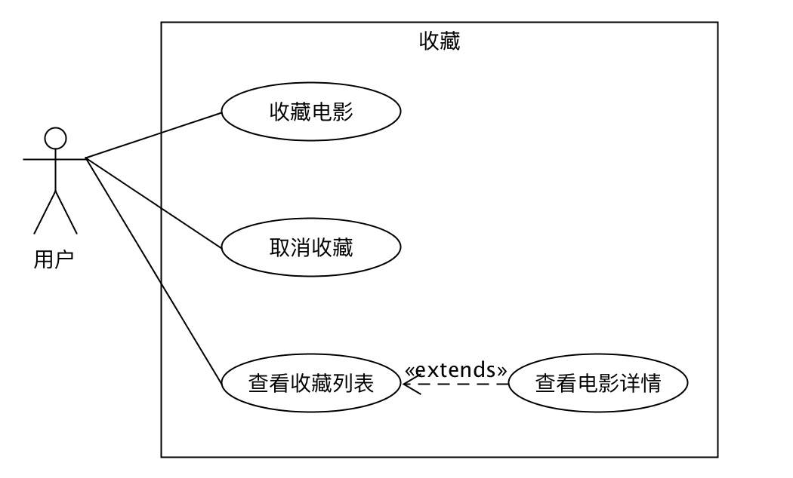
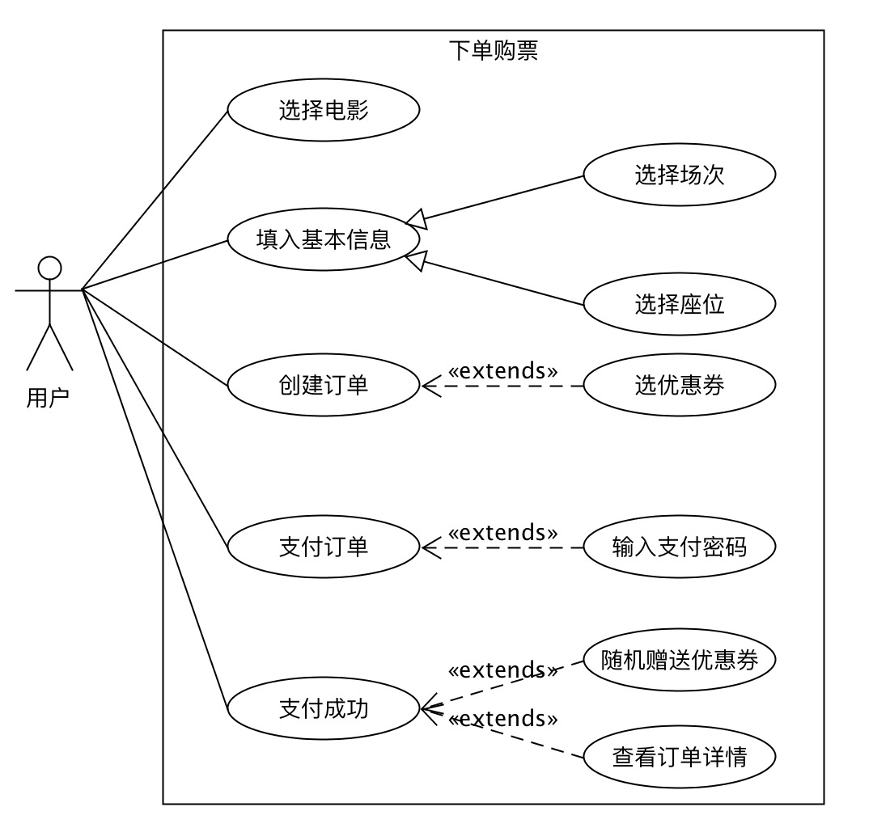
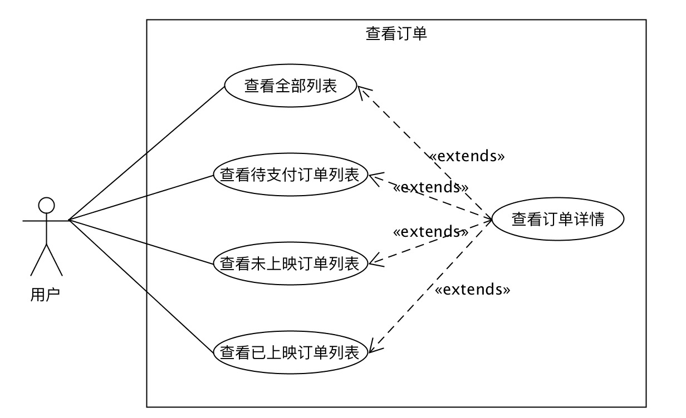
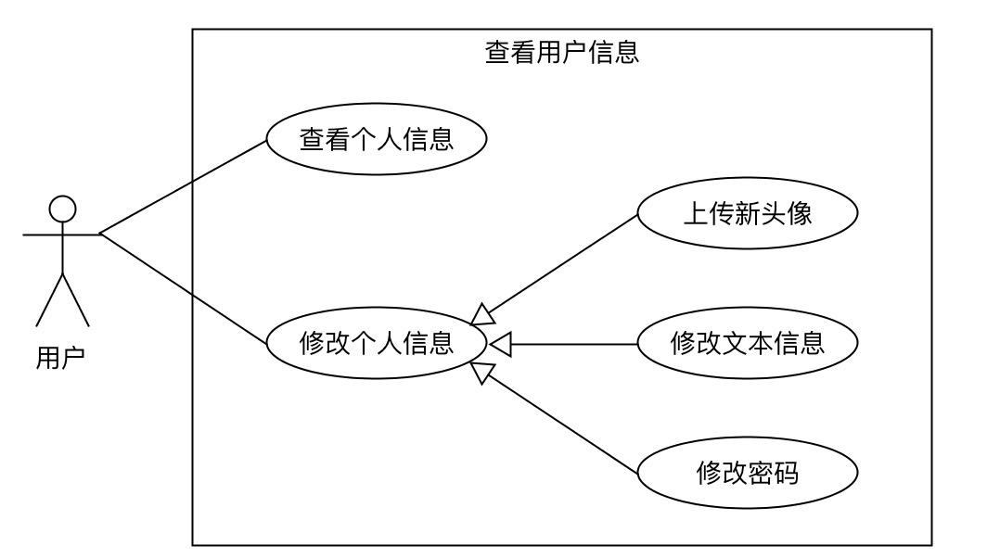
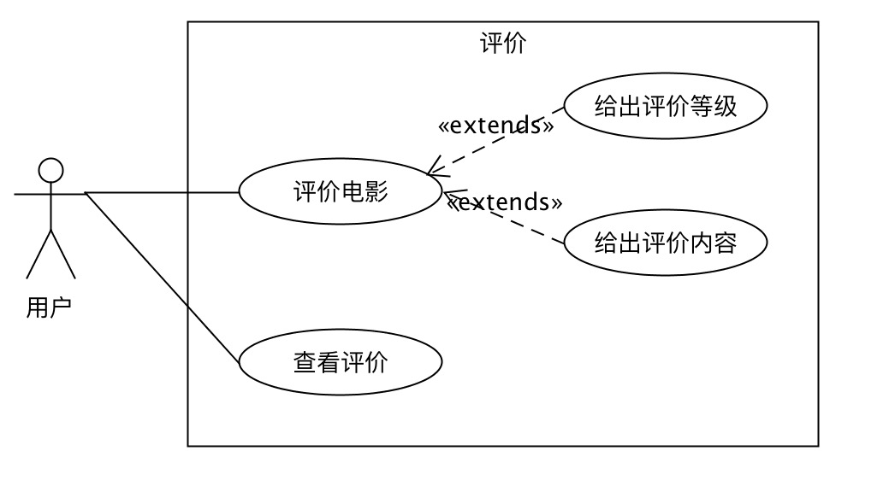

# 软件需求规格说明书
##### 小组成员：黄建武、洪创煌、骆铭涛、陈平永

## 1、引言
#### 1.1、目的
本文档将描述项目的整体结构和功能结构概貌，从总体结构上给出整个系统的轮廓，并对整个应用的功能以及性能需求进行详细描述。便于用户和开发人员进行沟通交流。

#### 1.2、背景
本次待开发软件为电影购票系统。用户使用该可以在本应用实现查看和搜索正在热映和即将上映的电影资讯，对感兴趣的电影可以进行收藏。想要观看某部电影，可以进行下单购票操作。对于已经放映的电影订单，用户可以对该订单对应的电影进行评分评价的操作。

#### 1.3、参考文献
[1] GB-T8567-2006，《计算机软件文档编制规范》[S]

[2] <教师报课系统>需求规格说明书，https://wenku.baidu.com/view/b36901336d175f0e7cd184254b35eefdc9d31557.html

## 2、项目概述
#### 2.1、产品描述
开发基于Android平台和移动端web平台的应用程序，实现基础的电影购票功能，并提供电影资讯查询和评分。为互联网购票提供简便高效的平台。

#### 2.2、产品功能
接下来通过用例图来辅助描述产品的功能。

用户可以通过查看资讯来查看电影，也可以通过直接搜索来查看电影。电影资讯包括两种类型：正在热映和即将上映。除了以上两种方式外，在应用首页也会推荐一些热门电影供用户查看。不管是以何种方式查看电影，都可以点击进入详情页面查看某部电影的详细信息。 

用户可以收藏感兴趣的电影，也可以取消收藏。在个人信息界面还可以查看自己收藏的所有电影列表。通过点击列表项目也可以查看到电影的详情。 

选择想要观看的电影之后，可以进行购票操作。购票时需要选择该电影放映的场次和座位信息。基本信息选择完成之后就可以创建订单了，创建订单的时候，如果用户还有优惠券，那么可以选择使用优惠券。订单创建完成后可以对订单进行支付，支付订单需要输入支付密码。最后，订单完成支付后用户可以看到订单的详细信息，系统还会随机送给用户优惠券。

根据订单类型不同，用户可以查看的订单列表也有多种。每种订单都可以查看到订单的详细信息。

用户可以查看自己的用户信息，也可以对自己的部分信息进行修改。修改的信息根据内容的不同，修改方式也有所不同，例如修改头像需要上传文件，修改昵称或签名则只是简单的文本修改，而修改登录密码或支付密码则需要提供原始密码等关键信息。

用户对观看过了的电影可以进行打分和评价，也可以查看其他用户对某部电影的评价。评价电影的时候用户可以对其进行等级评分和给出文字描述。

#### 2.3、用户特点
本软件的最终用户为喜爱观影的用户，熟悉移动端支付流程，对手机购买消费行为较为熟悉。

#### 2.4、一般约束
进行本软件开发的约束条件如下：

* 开发周期短：本项目开发周期为2个月，需要合理规划时间完成前端与后端的开发。
* 技术先进：采取当下流行的前后端分离技术以及前后端框架，要求对先进技术有一定的了解并且能够熟练运行。

#### 2.5、假设与依据
本项目能够成功实施，主要取决于：

* 团队成员积极配合，合理规划时间，完成各自负责的模块开发工作
* 团队掌握先进开发技术，能够熟练运行先进技术对系统进行性能等方面的优化，提供质量保证

## 3、具体需求
#### 3.1、功能需求
* 用户可以通过查看资讯来查看电影，也可以通过直接搜索来查看电影。电影资讯包括两种类型：正在热映和即将上映。除了以上两种方式外，在应用首页也会推荐一些热门电影供用户查看。不管是以何种方式查看电影，都可以点击进入详情页面查看某部电影的详细信息。 
* 用户可以收藏感兴趣的电影，也可以取消收藏。在个人信息界面还可以查看自己收藏的所有电影列表。通过点击列表项目也可以查看到电影的详情。 
* 用户选择想要观看的电影之后，可以进行购票操作。购票时需要选择该电影放映的场次和座位信息。基本信息选择完成之后就可以创建订单了，创建订单的时候，如果用户还有优惠券，那么可以选择使用优惠券。订单创建完成后可以对订单进行支付，支付订单需要输入支付密码。最后，订单完成支付后用户可以看到订单的详细信息，系统还会随机送给用户优惠券。
* 根据订单类型不同，用户可以查看的订单列表也有多种。每种订单都可以查看到订单的详细信息。
* 用户可以查看自己的用户信息，也可以对自己的部分信息进行修改。修改的信息根据内容的不同，修改方式也有所不同，例如修改头像需要上传文件，修改昵称或签名则只是简单的文本修改，而修改登录密码或支付密码则需要提供原始密码等关键信息。
* 用户对观看过了的电影可以进行打分和评价，也可以查看其他用户对某部电影的评价。评价电影的时候用户可以对其进行等级评分和给出文字描述。

#### 3.2、外部接口需求
##### 3.2.1、硬件接口
无特殊要求

##### 3.2.2、软件接口
本项目为基于移动端web的项目，需要安卓端提供WebView支持，并实现好以下接口：

* 访问本地文件：用于用户上传头像时候使用
* 缓存网页资源：用于实现H5缓存

##### 3.2.3、通信接口
无特殊要求

#### 3.3、性能需求
本应用为移动端的web应用，需要有较快的加载速度和页面渲染速度。页面上计算的内容不宜过度，以免造成界面卡顿。

#### 3.4、属性
##### 3.4.1、可用性
* 方便操作，操作流程合理。用户在查看电影资讯以及完成购票的过程中应该过程流畅，操作简便。
* 系统应具备容错能力，能够抵抗用户的某些不合理的操作。对于不合理操作应该给出清晰易懂的提示。

##### 3.4.2、安全性
* 权限控制，用户需要完成登录获得权限之后才能够进行购票、收藏和评价等操作。
* 用户密码和支付密码等隐私信息需要加密存储。

##### 3.4.3、可维护性
* 代码需要有较强的可读性，模块划分清晰，功能明确。
* 需要有合理的注释和软件开发文档说明。

## 4、验收验证标准
|序号|功能|详细操作|检验情况|
|--|--|--|--|
|1|登录|用户输入账号密码后成功登录，进入到个人中心界面。如果登录信息出错则给出提示并停留在登录界面。||
|2|注册|用户填写手机号、验证码、密码、支付密码信息后成功完成注册，进入到个人中心界面。如果注册信息出错则给出提示并停留在注册界面。||
|3|查看电影列表|用户在主界面可以查看正在热映和即将上映的电影列表，如果电影列表为空需要给出暂无咨询的提醒。点击列表项可以跳转到电影详情界面。也可以点击购票图标直接跳转到选场次界面。点击主界面上的搜索电影可以跳转到搜索界面。||
|4|查看电影详情|用户在电影详情界面可以看到某部电影的详细资料以及用户评价信息。点击收藏按钮可以收藏或者取消收藏该电影，点击立即购票按钮可以跳转到选场次界面。||
|5|搜索电影|在搜索界面输入关键字后点击搜索按钮可以搜索相关电影。点击取消按钮可以清空关键字。||
|6|选择场次|在选场次界面可以选择最近3天的场次。如果当天没有安排该电影的场次则显示暂无场次提示。选完场次后跳转到选择座位界面进行后续操作。||
|7|选择座位|在选择座位界面会显示座位俯视图，通过点击座位方块来选择作为，1个用户最多能选择4个座位，即购买4张票。完成选座后跳转到确认订单界面。||
|8|确认订单|确认订单界面会显示订单的详细信息，用户确认后就可以跳转支付界面进行支付。||
|9|支付订单|在支付界面输入支付密码后完成支付操作。如果密码错误则给出相应的提示。支付成功后跳转到订单详情界面。||
|10|查看订单列表|在个人中心界面，用户可以选择查看全部订单、待支付订单、未放映订单和已放映订单并跳转到相应的订单列表界面。点击订单列表项可以跳转到对应订单的详情界面。如果是未支付订单还可以直接点击支付按钮跳转到支付界面。如果是已放映订单还可以直接点击评价按钮跳转到电影评价界面。||
|11|查看订单详情|在订单详情界面会显示订单的详细信息和状态。||
|12|查看收藏列表|在个人中心界面，用户可以查看收藏和期待的电影并跳转到相应的电影列表。点击列表项可以跳转到电影的详情界面。||
|13|查看优惠券|在个人中心界面点击优惠券可以跳转到优惠券列表界面，用户可以在此查看属于自己的所有有效优惠券信息。||
|14|评价电影|在评价电影界面，用户可以对电影进行评分，并写下相关文字评语。点击发布按钮后可以发布评价。||
|15|查看个人信息|在用户信息界面可以查看到当前登录用户的基本信息，点击信息项可以对相应的信息进行修改。||
|16|修改个人信息|用户可以修改头像、昵称、签名、密码、支付密码这几项信息。如果操作失败会给出相应的错误提示。||
